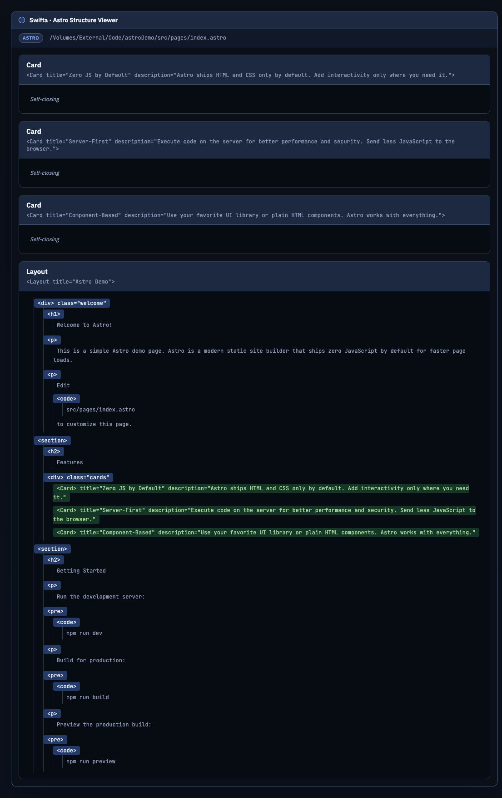
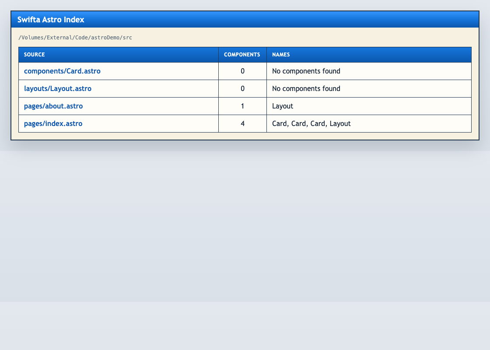

# Swifta

Swifta is a hexagonal Astro template parser built on top of ANTLR. It parses `.astro` files and produces a structural model of components, HTML elements, expressions, scripts, and styles — rendered as interactive HTML tree diagrams.

The project starts from the domain, not from the framework:

* **business goal**: convert Astro source into a stable structural model for downstream tooling
* **architectural style**: DDD-inspired layered monolith with hexagonal boundaries
* **parser engine**: ANTLR4 with a custom Astro grammar (lexer modes for frontmatter, tags, expressions, scripts, and styles)
* **delivery channel**: CLI that parses a file or directory and outputs HTML structure diagrams

## What the system does

* **Parsing Astro templates**
  * parse a single `.astro` file
  * parse a directory of `.astro` files recursively
  * extract a structural model: frontmatter, HTML elements, components (PascalCase tags), fragments, template expressions, scripts, and styles

* **Structure diagrams**
  * build an HTML tree diagram for a single `.astro` file showing the full component hierarchy
  * build diagram bundles for entire directories with an index page linking all files
  * color-coded node types: HTML tags (blue), components (green), expressions (purple), text (muted), scripts (orange), styles (teal), fragments (blue)
  * dark theme with JetBrains Mono and IBM Plex Sans fonts

* **Architecture**
  * parser infrastructure behind ports so the application layer stays independent from ANTLR, filesystem, and CLI details

## Quick Start

1. Install dependencies:

```bash
uv sync --extra dev
```

2. Generate the ANTLR parser from the vendored grammar:

```bash
uv run python scripts/generate_astro_parser.py
```

3. Parse a single file:

```bash
uv run swifta parse-file path/to/page.astro
```

4. Parse a directory:

```bash
uv run swifta parse-dir path/to/astro-project/src
```

5. Build a structure diagram for a single file:

```bash
uv run swifta struct-file path/to/page.astro --out output/page.struct.html
```

6. Build structure diagrams for an entire directory:

```bash
uv run swifta struct-dir path/to/astro-project/src --out output/struct-bundle
```

## Screenshots

**Structure diagram** — component hierarchy for an Astro page with nested HTML elements and component tags:



**Directory index** — overview of all parsed `.astro` files with component counts:



## Architecture

The codebase is split into four explicit layers:

* `domain`: domain model, control flow types, ports, and domain events
* `application`: use cases and DTOs
* `infrastructure`: ANTLR adapter, filesystem adapters, HTML rendering
* `presentation`: CLI contract

```
src/swifta/
├── domain/
│   ├── model.py              # StructuralElementKind, SourceUnit
│   ├── control_flow.py       # TemplateStep types, StructureDiagram
│   └── ports.py              # AstroSyntaxParser, AstroStructureExtractor, NassiDiagramRenderer
├── application/
│   └── control_flow.py       # Use case: parse & render
├── infrastructure/
│   ├── antlr/
│   │   ├── runtime.py        # ANTLR loader and parse helpers
│   │   ├── parser_adapter.py # AntlrAstroSyntaxParser
│   │   └── control_flow_extractor.py  # AntlrAstroStructureExtractor
│   ├── filesystem/
│   │   └── source_repository.py       # .astro file discovery
│   └── rendering/
│       └── struct_html_renderer.py    # HTML tree diagram renderer
└── presentation/
    └── cli/
        └── main.py           # Typer CLI
```

## Grammar

The Astro grammar lives in `resources/grammars/astro/` as a git submodule. The lexer uses seven modes:

| Mode | Purpose |
|---|---|
| `DEFAULT` | Top-level template content |
| `FRONTMATTER` | Content between `---` delimiters |
| `TAG` | Inside HTML/component tag attributes |
| `EXPR` | Template expressions `{...}` |
| `SCRIPT` | `<script>` block content |
| `STYLE` | `<style>` block content |

## Next Steps

Useful future extensions:

* component prop type extraction from frontmatter
* component dependency graph visualization
* unused component detection
* interactive HTML diagrams with collapsible nodes
* export to other formats (SVG, Mermaid)
* integration with Astro dev server as a plugin
